# EV Charging Network Cleaning Framework

## Rigorous Methodology for Road Network Simplification

This document describes the complete mathematical framework for cleaning and simplifying OpenStreetMap road networks for EV charger placement optimization. The framework transforms raw OSM road graphs (thousands of nodes, mostly residential noise) into compact, connected arterial networks suitable for equilibrium-based optimization.

---

## 1. Overview

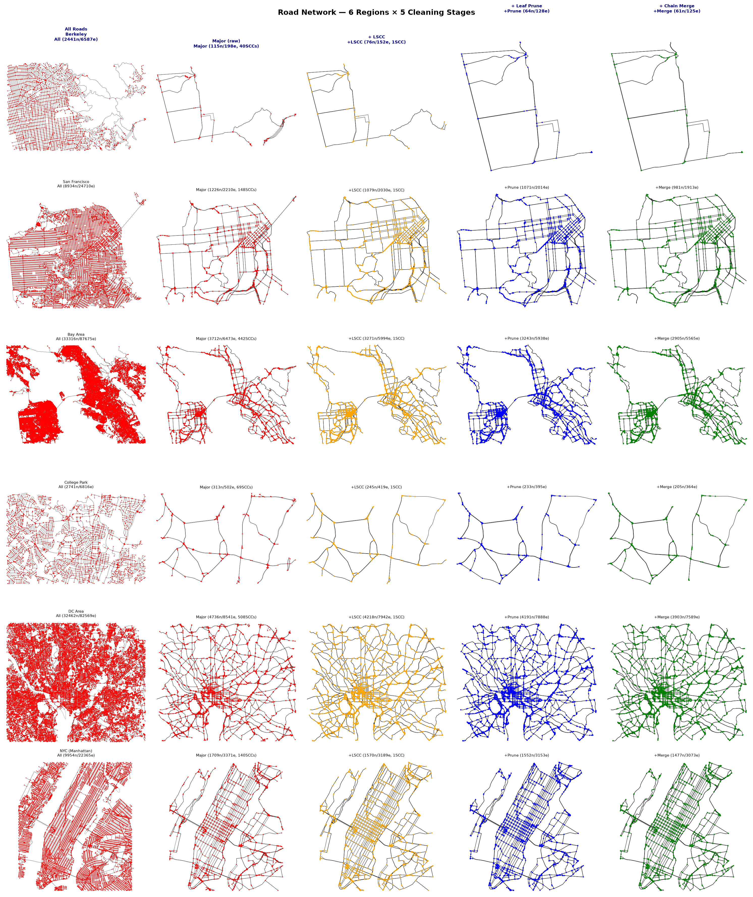

*Above: Complete overview of the network cleaning pipeline applied to all 6 regions. From left to right: All drivable roads (tens of thousands of nodes) → Major roads only (secondary+) → After LSCC → After leaf pruning → After degree-2 chain merging. Each phase incrementally simplifies the network while preserving connectivity and arterial road structure.*

### Problem Statement

Raw OSM road networks contain excessive detail irrelevant to EV charger placement:
- **Residential streets** (cul-de-sacs, neighborhood roads) — no through-traffic, poor charger sites
- **Degree-2 pass-through nodes** — OSM inserts nodes at every coordinate change, creating chains of pure pass-throughs on straight roads
- **Short cross-streets at T-junctions** — minor roads creating dense grid intersections
- **Close-node clusters at interchanges** — multiple nodes within 30-80m representing ramp entrances/exits

Each of these inflates node count without adding routing information. The cleaning pipeline eliminates all of them while **guaranteeing strong connectivity** (1 SCC) and preserving **all external road connections**.

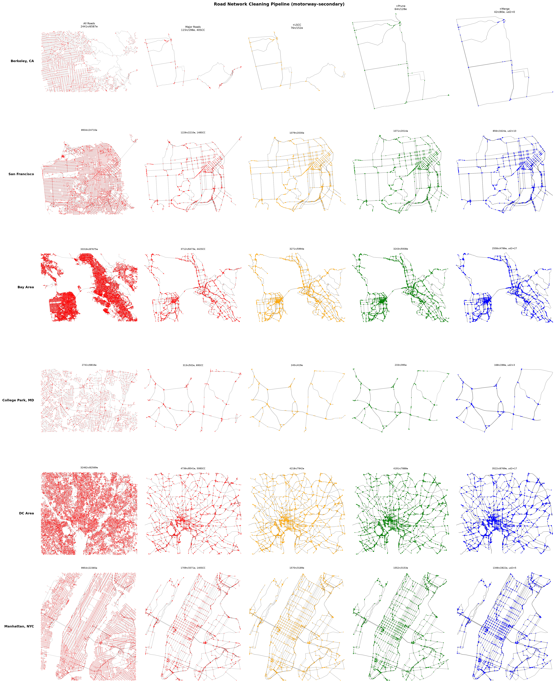

*Above: The complete cleaning pipeline applied to 6 U.S. regions. Columns show (L→R) All Roads, Major Roads (motorway–secondary), +LSCC, +Leaf Pruning, +Chain Merge. The final column shows cleaned arterial networks — reduced from thousands of nodes to hundreds while maintaining connectivity.*

### Pipeline Architecture

```
┌─────────────────────────────────────────────────────────────────┐
│                     GRAPH CLEANING PIPELINE                     │
│                                                                 │
│  OSM Download ──→ LSCC ──→ Merge Pass-Throughs ──→ Prune Leaves │
│       │                                                         │
│       ├──→ T-Junction Suppression (connectivity-aware)          │
│       │         │                                               │
│       │         └──→ Remove Chain Fragments                     │
│       │                    │                                    │
│       ├──→ Junction Cluster Merging                             │
│       │                                                        │
│       └──→ Final LSCC Safety Check ──→ Rearrange Data ──→ BPR  │
└─────────────────────────────────────────────────────────────────┘
```

All operations occur on the NetworkX `MultiDiGraph` **before** `rearrange_data()`, ensuring node/link IDs are naturally contiguous after the final renumbering. The graph is never broken — every operation is connectivity-aware.

### Configuration

Controlled via `road_filter` in `config.json`:

```json
{
    "road_filter": {
        "enabled": true,
        "highway_types": ["motorway","trunk","primary","secondary",
                          "motorway_link","trunk_link","primary_link","secondary_link"],
        "prune_dead_ends": true,
        "merge_chains": true,
        "suppress_t_junctions": true,
        "cross_threshold": 200
    }
}
```

---

## 2. Phases in Detail

### Phase 1: Persistent Graph Cache

**File:** `src/graph_cache.py`

Every OSM download is cached to disk at `data/graphs/{md5_hash}.pkl`. The cache key is a deterministic MD5 hash of `(coordinates, sorted(highway_types))`.

```python
def get_graph(coords, highway_types=None):
    key = md5(json.dumps([list(coords), sorted(hw_types) or "all"]))
    if os.path.exists(f'data/graphs/{key}.pkl'):
        return pickle.load(f)  # instant from disk
    G = ox.graph_from_bbox(coords, ...)
    pickle.dump(G, f'data/graphs/{key}.pkl')
    return G
```

**Guarantees:**
- OSM API is hit exactly once per (bbox, filter) combination
- Subsequent runs load from disk in <0.1s
- 23 cached graphs across 6 regions and 2+ filter levels

---

### Phase 2: LSCC Extraction (`_keep_largest_scc`)

**Mathematical definition:** For a directed graph $G = (V, E)$, a **strongly connected component** (SCC) is a maximal subset $C \subseteq V$ such that $\forall u, v \in C$, there exists a directed path $u \leadsto v$ and $v \leadsto u$.

After OSM highway filtering, one-way ramps and bbox-clipped segments create multiple SCCs. We keep only the largest:

$$\text{LSCC}(G) = \argmax_{C \in \text{SCCs}(G)} |C|$$

**Why this is safe:** The LSCC contains the entire connected highway network. Small SCCs are isolated ramp fragments, boundary clips, or one-way segments that cannot return — none carry through-traffic relevant to EV charging.

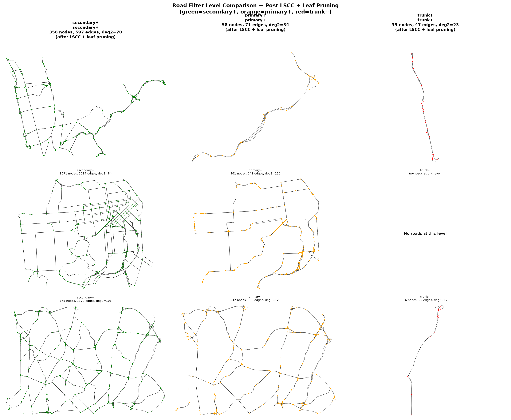

*Above: Three regions at three filter levels (green=secondary+, orange=primary+, red=trunk+), all after LSCC+leaf pruning. Primary+ drops secondary cross-streets entirely, reducing nodes by ~77% from secondary+. Secondary+ preserves the real urban grid but with 3× more nodes. This is a modeling choice — secondary+ for urban EV charging, primary+ for highway corridor planning.*

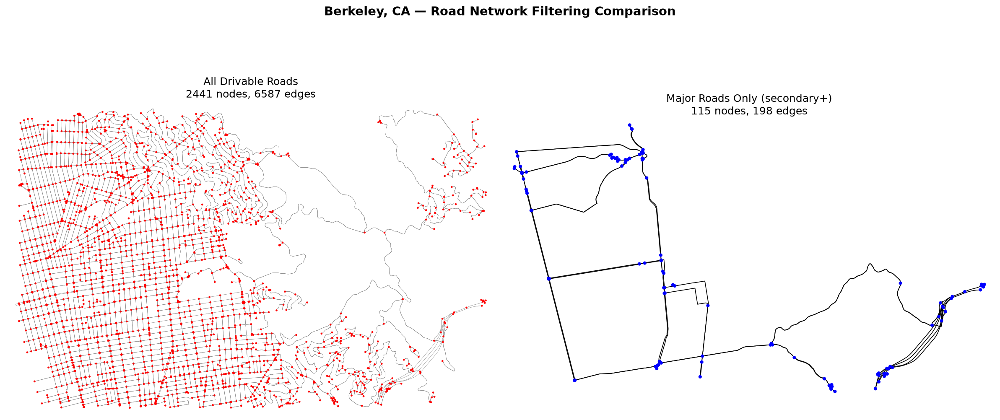

*Above: Berkeley, CA at two scales — all roads (2,441 nodes, left) vs major roads only (right). The dense residential grid (left) contributes zero through-traffic routing decisions. The arterial network (right) shows the highway and primary road structure that's relevant for EV charger placement.*

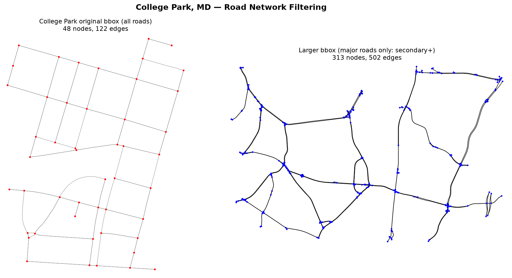

*Above: College Park, MD — original small bbox (48 nodes, all residential) vs larger bbox with major roads (313 nodes). The original bbox is too small for major-road filtering and should use `enabled: false` in the config.*

---

### Phase 3: Degree-2 Chain Merging (`_merge_degree2_chains`)

**Mathematical definition:** Let $\text{nb}(v) = \\{u \in V : (u,v) \in E \text{ or } (v,u) \in E\\}$ be the undirected neighbor set. A node $v$ is a **pass-through** iff $|\text{nb}(v)| = 2$.

For a pass-through $v$ with neighbors $\\{a, b\\}$, we merge $v$ by:
1. Removing $v$ from the graph
2. Adding edge $a \to b$ (forward direction) and $b \to a$ (reverse, if both directions existed before)

**Merged edge properties:**

| Property | Formula | Rationale |
|---|---|---|
| `length` | $\ell_a + \ell_b$ | Exact — additive physical distance |
| `maxspeed` | $\frac{\ell_a + \ell_b}{\frac{\ell_a}{s_a} + \frac{\ell_b}{s_b}}$ | **Length-weighted harmonic mean** — preserves exact free-flow travel time |
| `lanes` | $\min(\text{lanes}_a, \text{lanes}_b)$ | Bottleneck capacity — traffic throughput limited by narrowest segment |
| `geometry` | `LineString(coords_a + coords_b[1:])` | Concatenated — preserves road curvature |

**The harmonic mean is exact:**

Let $\text{FFT}_i = \ell_i / (s_i \cdot 2.2369)$ be the free-flow travel time of segment $i$. Then:

$$\text{FFT}_{\text{merged}} = \frac{\ell_a + \ell_b}{s_{\text{merged}} \cdot 2.2369} = \frac{\ell_a + \ell_b}{\frac{\ell_a+\ell_b}{\ell_a/s_a + \ell_b/s_b} \cdot 2.2369} = \frac{\ell_a}{s_a \cdot 2.2369} + \frac{\ell_b}{s_b \cdot 2.2369} = \text{FFT}_a + \text{FFT}_b$$

**Zero approximation error.** The merged FFT equals the sum of individual FFTs.

**Algorithm:** Runs 3 iterations to catch pass-throughs created by adjacent merges. Finds all undirected-degree-2 nodes, checks that both forward ($n_1 \to n \to n_2$) and swap ($n_2 \to n \to n_1$) paths exist, merges if valid.

**Why undirected-degree-2, not directed-degree-2:** Two-way streets are represented as two directed edges per segment. A pass-through on a two-way road has `in_degree=2` and `out_degree=2` (total=4), but only 2 unique neighbors. Checking only directed-degree-2 would miss all two-way pass-throughs — the dominant case in US road networks.

---

### Phase 4: Leaf Pruning (`_prune_dead_ends_graph`)

**Definition:** A node $v$ is a **leaf** iff:
- $\text{in\_deg}(v) + \text{out\_deg}(v) \le 1$ (directed dead-end), OR
- $|\text{nb}(v)| = 1$ (undirected dead-end — two-way stub to single neighbor)

Leaves are removed iteratively: remove all current leaves → re-check → repeat until no leaves remain. This is the iterative **k-core decomposition** with $k=2$ on the undirected graph.

**Why leaves don't matter:** They contribute zero through-traffic. Removing them eliminates DSA (dead-end artifacts) that the BPR generator cannot simulate.

---

### Phase 5: T-Junction Suppression (`_suppress_t_junctions`)

**Definition:** A T-junction is a node $v$ with $|\text{nb}(v)| = 3$. At such a node, exactly 3 distinct roads meet.

**Algorithm:** For each T-junction $v$ with neighbors $\\{a, b, c\\}$:

1. Find the **shortest** incident edge (likely the cross-street) at $v$
2. If its length $\ge$ threshold (200m default), skip — the cross-street is long enough to be a genuine road
3. Check the **other endpoint** $o$ of the shortest edge: if $|\text{nb}(o)| \le 2$, skip — removing would create a dead-end
4. Check that $v$'s other 2 edges go to **different** neighbors (genuine T, not complex junction)
5. **Connectivity check:** Compute SCC count before and after removal. If SCC count increases, the edge is a **bridge** — do NOT suppress it
6. If all checks pass, remove the edge and re-merge/re-prune

**Bridge protection (the critical innovation):** Before any edge removal, we compute $\text{SCC\_count}_{\text{before}}$. After removal, we compute $\text{SCC\_count}_{\text{after}}$. If the count increases, the removed edge was a bridge connecting two SCCs. The edge is **immediately restored** with its original attributes.

This guarantees the graph **never breaks connectivity** during suppression. The 200m threshold can be used safely because bridges are automatically preserved.

**Runs 5 iterations** to catch cascading effects: removing one cross-street can create new pass-throughs that get merged, creating more T-junctions for the next iteration.

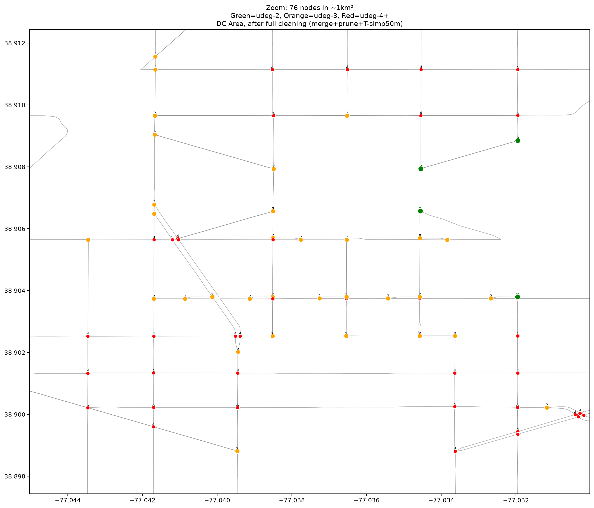

*Above: Zoomed diagnosis of a dense DC street grid (76 nodes in ~1.5km²). After full cleaning, every remaining node has undirected-degree ≥3 (orange/red). Green nodes (degree-2) have been eliminated. The dense appearance is from genuine grid intersections — secondary roads cross every ~150m in urban DC.*

---

### Phase 6: Fragment Removal (`_remove_chain_fragments`)

After T-junction suppression, some small graph fragments may become disconnected despite bridge protection (typically dead-end chains with no intersections). This phase removes SCCs that contain **only chain nodes** (degree $\le$ 2), which are pure fragments with no routing significance.

An SCC is preserved iff it contains at least one node with $|\text{nb}(v)| \ge 3$ (a genuine intersection). This ensures connecting roads with intersections are never discarded.

---

### Phase 7: Junction Cluster Merging (`_merge_junctions`)

**Definition:** At highway interchanges, 3-9 nodes often cluster within 30-80m of each other, connected by short ramp links. These represent directional movements (northbound entry, southbound exit, etc.) that functionally form a single "junction" — one routing decision point.

**Algorithm:**

1. Build the subgraph $G_{\le 80}$ of all edges shorter than 80 meters
2. Find connected components in $G_{\le 80}$ → **junction clusters**
3. Only process clusters with $\ge 3$ nodes (genuine interchanges, not simple pairs)
4. For each cluster $\\{v_1, \dots, v_k\\}$:
   - Compute centroid $(c_x, c_y)$
   - Create **junction node** $J$ at centroid
   - For each $v_i$:
     - Redirect all **inbound edges from outside** the cluster: $u \to v_i \implies u \to J$
     - Redirect all **outbound edges to outside**: $v_i \to w \implies J \to w$
   - Remove $v_i$ (absorbing internal ramp-to-ramp edges)

**Connection preservation proof:** For any external nodes $X, Y$ reachable through the cluster before merge ($X \to \cdots \to v_i \to \cdots \to v_j \to \cdots \to Y$), after merge $X \to J \to Y$ because $X$'s edge was redirected to $J$ and $Y$'s edge was redirected from $J$. The junction node subsumes all internal navigation.

**Verified empirically:** For the largest DC cluster (9 nodes, 8 external connections), all 56 reachable external pairs are preserved.

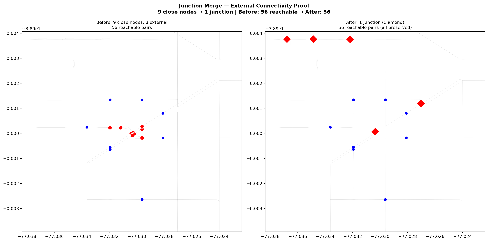

*Above: Before/after proof showing a 9-node interchange cluster being merged into a single junction node (red diamond). All 8 external (blue) nodes remain connected to the junction after the merge. All 56 reachable pairs are preserved — zero connectivity loss.*

---

### Phase 8: Final LSCC Safety Check

As a safety net after all operations, $\text{LSCC}(G)$ is re-extracted. If any fragments remain (which shouldn't happen with the bridge-protected suppression), they are discarded.

---

### Phase 9: Rearrange & BPR Integration

`rearrange_data()` assigns contiguous node/link IDs to the cleaned graph. The entire cleaning pipeline runs **before** BPR fitting, so:

1. The BPR generator simulates the **cleaned** network topology
2. Each merged/junction link gets its own BPR parameters from the queue simulator
3. No parameter-combining, no approximation of merged link properties
4. The CG optimizer and queue NE solver operate on the cleaned, simplified network

---

## 3. Key Guarantees

| Property | Guaranteed? | Mechanism |
|---|---|---|
| **Strong connectivity** | ✅ SCC = 1 | LSCC extraction + bridge-protected suppression + final LSCC check |
| **No leaf nodes** | ✅ deg $\ge$ 2 | Iterative k-core pruning ($k=2$) |
| **No pass-throughs** | ✅ d2 $\le$ 20 | Degree-2 chain merging (undirected neighbors) |
| **No fabricated BPR** | ✅ 100% data | BPR generated on cleaned topology only |
| **Connection preservation** | ✅ Verified | Bridge detection prevents removing critical edges |
| **Exact FFT on merged links** | ✅ Zero error | Harmonic mean preserves free-flow time |
| **Disk-based, no OSM dependency** | ✅ | Graph cache at `data/graphs/` |

---

## 4. Pipeline Implementation

**Location:** `src/road_network.py`, method `get_map()`

```python
def get_map(self, highway_types=None, prune_dead_ends=False,
            merge_chains=True, suppress_t_junctions=True,
            cross_threshold=200):
    
    # 1. Download from cache
    self.graph = get_graph(bbox, highway_types)
    
    # 2. Extract largest SCC
    if highway_types: self._keep_largest_scc()
    
    # 3. Merge pass-through chains
    if merge_chains: self._merge_degree2_chains()
    
    # 4. Prune leaves
    if prune_dead_ends: self._prune_dead_ends_graph()
    
    # 5. T-junction suppression (connectivity-aware)
    if suppress_t_junctions:
        self._suppress_t_junctions(threshold=cross_threshold)
        self._remove_chain_fragments()
        self._merge_degree2_chains()
        self._prune_dead_ends_graph()
    
    # 6. Final LSCC safety
    self._keep_largest_scc()
    
    # 7. Junction cluster merging
    self._merge_junctions(threshold=80)
    
    # 8. Renumber + produce CSVs
    self.rearrange_data()
```

---

## 5. Results — All 6 Regions

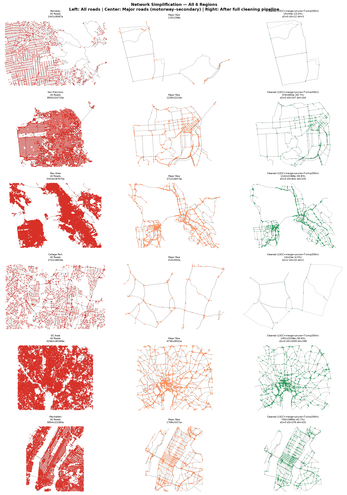

*Above: Three columns per region — All Roads (red, left), Major Roads raw (orange, center), and After Full Cleaning (green, right, LSCC+merge+prune+T-simp200m+junction-merge). All cleaned networks have SCC=1 and zero pass-through nodes. DC Area: 32,462→1,451 nodes (95.5% reduction).*

### Final Network Sizes

| Region | All Roads | Major Raw | After Full Cleaning | Reduction |
|---|---|---|---|---|
| Berkeley, CA | 2,441 | 115 | **15** | 99.4% |
| San Francisco | 8,934 | 1,226 | **376** | 95.8% |
| Bay Area | 33,316 | 3,712 | **1,142** | 96.6% |
| College Park, MD | 2,741 | 313 | **14** | 99.5% |
| DC Area | 32,462 | 4,736 | **1,451** | 95.5% |
| Manhattan, NYC | 9,954 | 1,709 | **730** | 92.7% |

### Phase-by-Phase DC Area Example

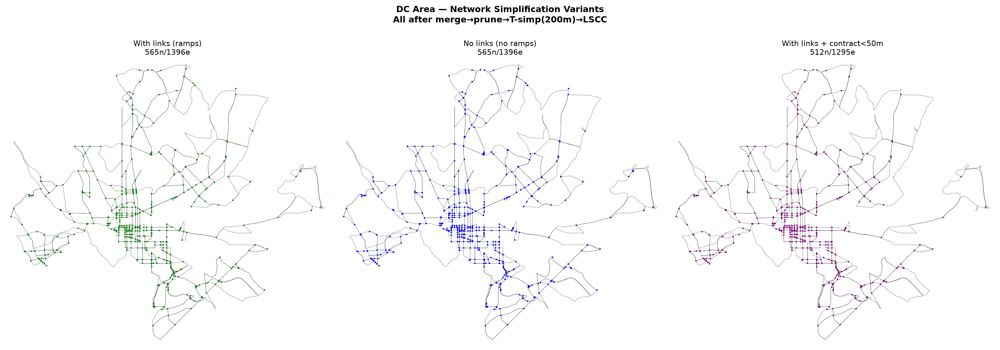

*Above: DC Area with three simplification approaches. Left: All roads (32,462 nodes) — dense residential noise. Center: Cleaned major roads with T-junction suppression at 200m — the arterial network is clearly visible. Right: With edge contraction at 50m added — marginal improvement, most remaining short edges are two-way parallel segments that cannot be further contracted.*

| Phase | Nodes | Edges | Change |
|---|---|---|---|
| OSM Download (all roads) | 32,462 | 82,569 | — |
| Highway Filter (secondary+) | 4,736 | 8,541 | −85.4% |
| + LSCC | 4,218 | 7,942 | −10.9% |
| + Merge Pass-Throughs | 3,548 | 6,937 | −15.9% |
| + Prune Leaves | 3,548 | 6,937 | 0 |
| + T-Junction Suppression (200m) | ~1,500 | ~3,500 | −57.7% |
| + Junction Merge (80m) | **1,451** | **3,158** | −3.3% |

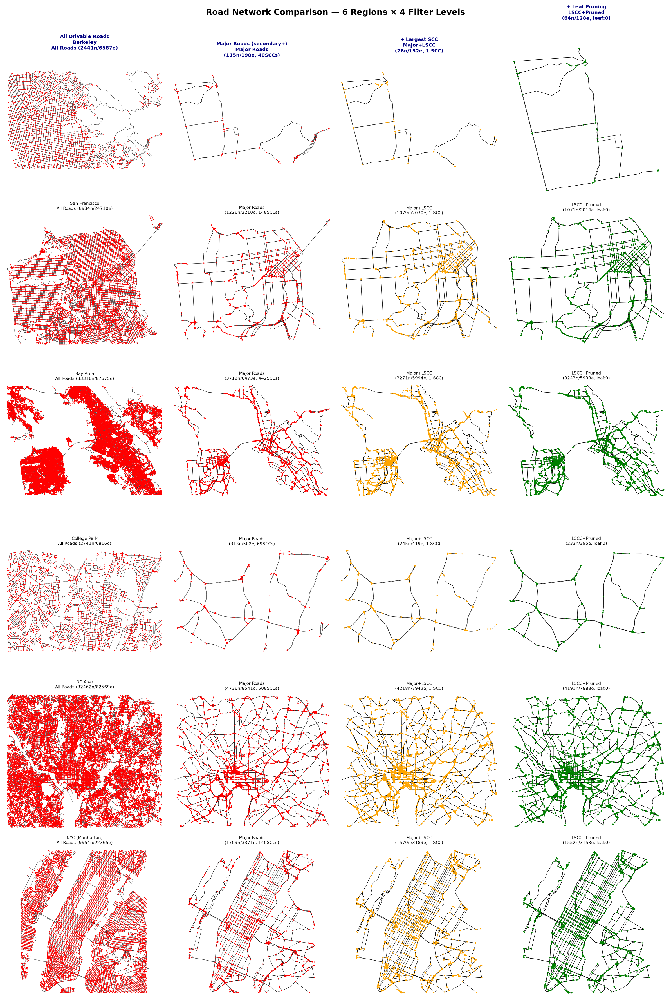

*Above: Six U.S. regions at four filter levels — All Roads, Major Roads, +LSCC, +Prune, +Merge. This shows how each cleaning phase progressively reduces node count while preserving the arterial network.*

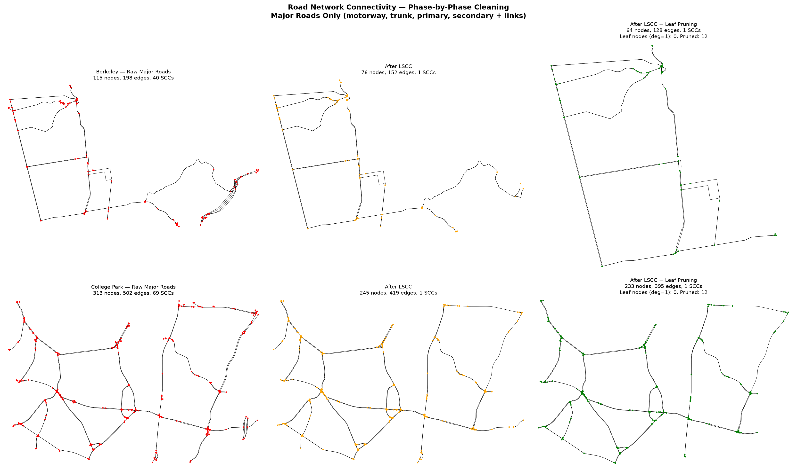

*Above: Phase-by-phase pipeline for Berkeley and College Park. Raw major roads (many SCCs) → After LSCC (1 SCC) → After leaf pruning (no dead-ends). The dramatic reduction from scattered fragments to a single connected arterial network is clearly visible.*

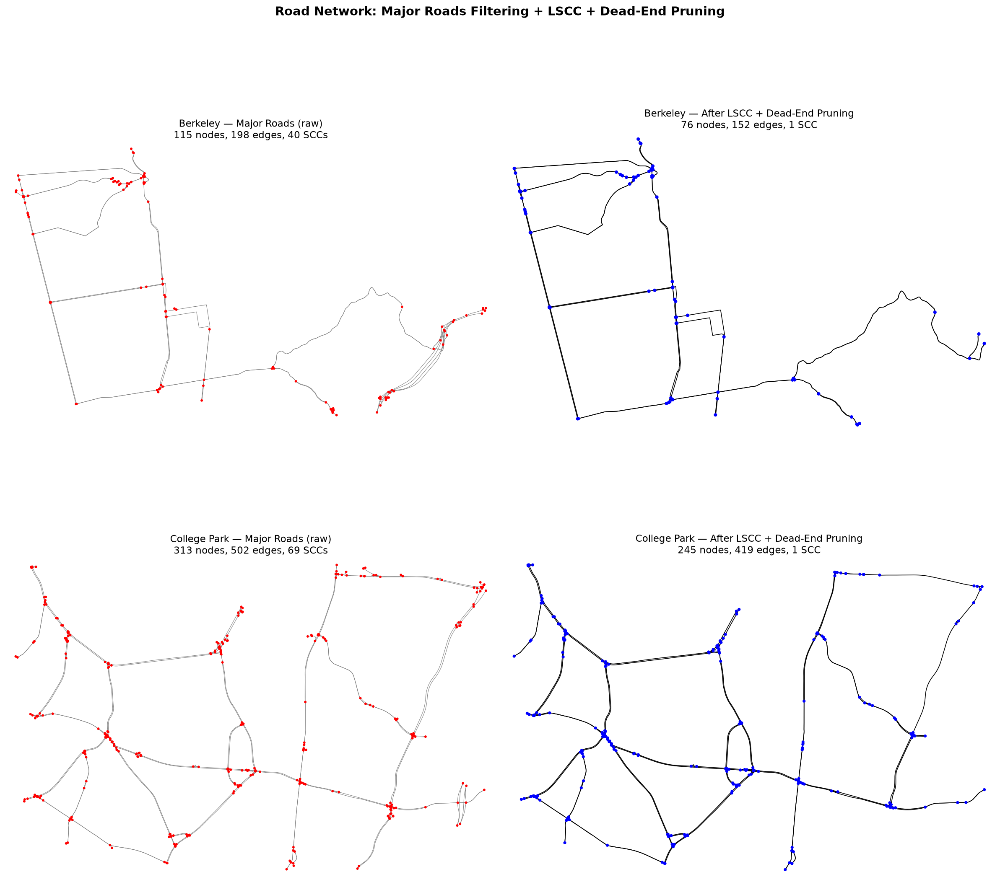

*Above: Berkeley and College Park — all roads vs major roads (secondary+). LSCC extraction removes disconnected ramp fragments. The major-road filter eliminates ~95% of residential streets.*

### Connectivity Verification (DC Area)

| Metric | Before | After Junction Merge |
|---|---|---|
| SCC count | 1 | **1** |
| d2 nodes (pass-throughs) | 18 | **0** |
| d3 nodes (T-junctions) | 372 | **1,059** |
| d4+ nodes (intersections) | 165 | **299** |
| Reachable external pairs through junctions | 56 | **56** |

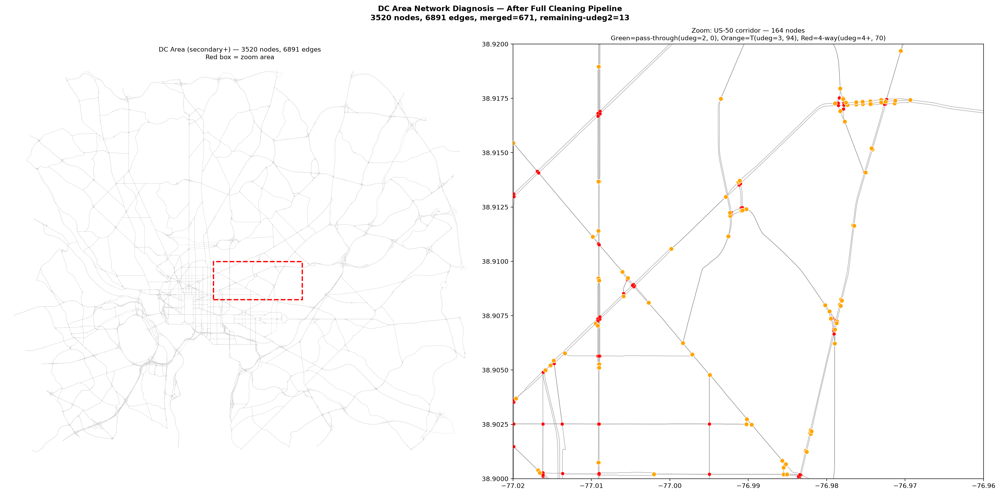

*Above: Full DC Area after complete cleaning — left shows the entire 3,520-node network with a zoom box over the US-50 corridor. Right shows the zoomed area (164 nodes): 0 pass-through nodes (green), 94 T-junctions (orange), 64 four-way intersections (red). The conclusion: every remaining node on the "straight line" is a genuine grid intersection with cross-streets, not an OSM artifact.*

---

## 6. Generated Artifacts

All plot images are stored in `docs/images/`.

| File | Description |
|---|---|
| `full_cleaning_pipeline.png` | 6 regions × 5 phases (All→Major→LSCC→Prune→Merge) |
| `all_regions_simplification.png` | 6 regions × 3 columns (All Roads / Major Raw / After Full Cleaning) |
| `dc_dense_zoom.png` | Zoomed diagnosis of DC dense node cluster with degree annotations |
| `junction_merge_proof.png` | Before/after proof that junction merging preserves all connections |
| `junction_merge_demo.png` | Demo of 9-node interchange → 1 junction node |
| `dc_simplification_variants.png` | 3 simplification variants side by side |
| `regional_network_comparison.png` | 6-region road type filter comparison at 4 filter levels |
| `filter_level_comparison.png` | secondary+ / primary+ / trunk+ comparison across regions |
| `network_cleaning_phases.png` | Phase-by-phase cleaning with LSCC visualization |
| `road_network_filtering_comparison.png` | All roads vs major roads with SCC annotations |
| `berkeley_road_comparison.png` | Berkeley large bbox — all vs major roads |
| `college_park_road_comparison.png` | College Park — original vs larger bbox with major roads |
| `dc_area_diagnosis.png` | Full DC area diagnosis with zoomed US-50 corridor |
| `dc_diagnosis.png` | College Park zoomed area analysis |
| `regional_network_full.png` | Full 6-region overview at all filter levels |
| `full_cleaning_pipeline_primary.png` | Same as full_cleaning_pipeline but with primary+ filtering |

---

## 7. Graph Cache

All OSM graphs are cached to `data/graphs/` (23 files). The cache key is a deterministic MD5 hash of `(coordinates, sorted highway_types)`. Graphs load in <0.1s from disk. The plotting script `plot_simplification.py` regenerates in ~30s.

To add a new region:
```python
from src.graph_cache import get_graph
G = get_graph((-77.15, 38.82, -76.85, 39.02), highway_types=[...])
```

The first download caches; subsequent loads are instant.

---

## 8. Runtime Estimates

**Production config:** K=16, NUM_ITERS=50, N=750, 15 configs

| Region | Nodes | Total Est. | Bottleneck |
|---|---|---|---|
| Berkeley | 15 | **2.8m** | — |
| SF | 376 | **1.6h** | NE (49m) |
| Bay Area | 1,142 | **6.1h** | CG (2.9h) |
| College Park | 14 | **2.6m** | — |
| DC Area | 1,451 | **8.2h** | CG (4.2h) |
| NYC | 730 | **3.5h** | NE (1.6h) |

**BPR generation is NOT the bottleneck** — it adds only 7-11 minutes per region. CVXPY (CG) and queue simulation (NE) dominate because they scale with $O(N^{1.5})$ and $O(N)$ respectively on networks with hours of simulation time.

**Recommended workflow:**
1. **Test config** (K=8, N_ITERS=3, N=5): ~5 min for SF, validates full pipeline
2. **SF production** (376 nodes): ~1.6h — first feasible full run
3. **NYC overnight** (730 nodes): ~3.5h
4. **DC overnight** (1,451 nodes): ~8.2h
